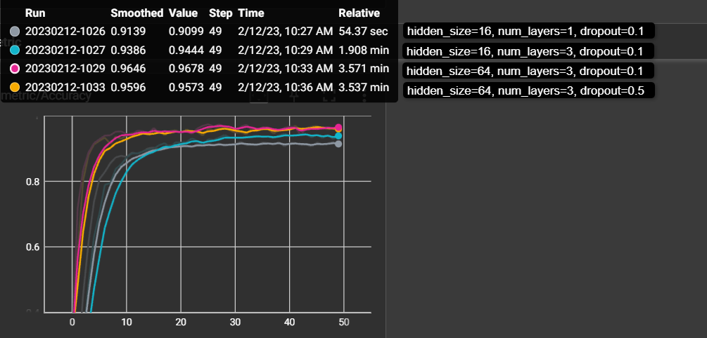
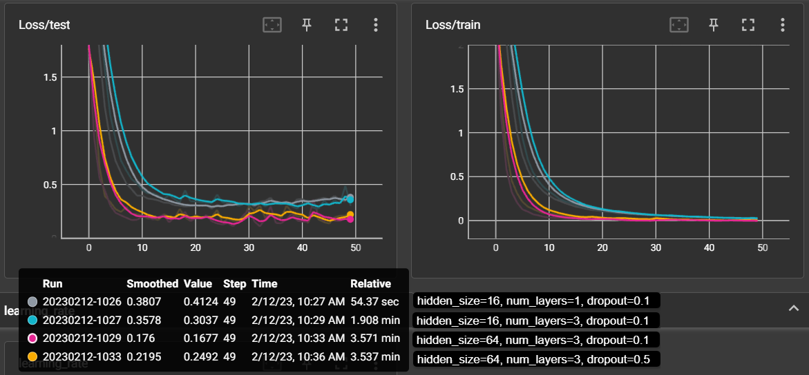
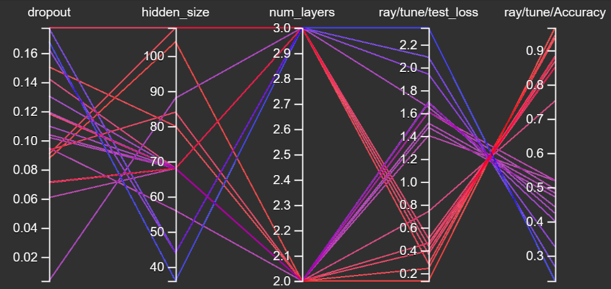
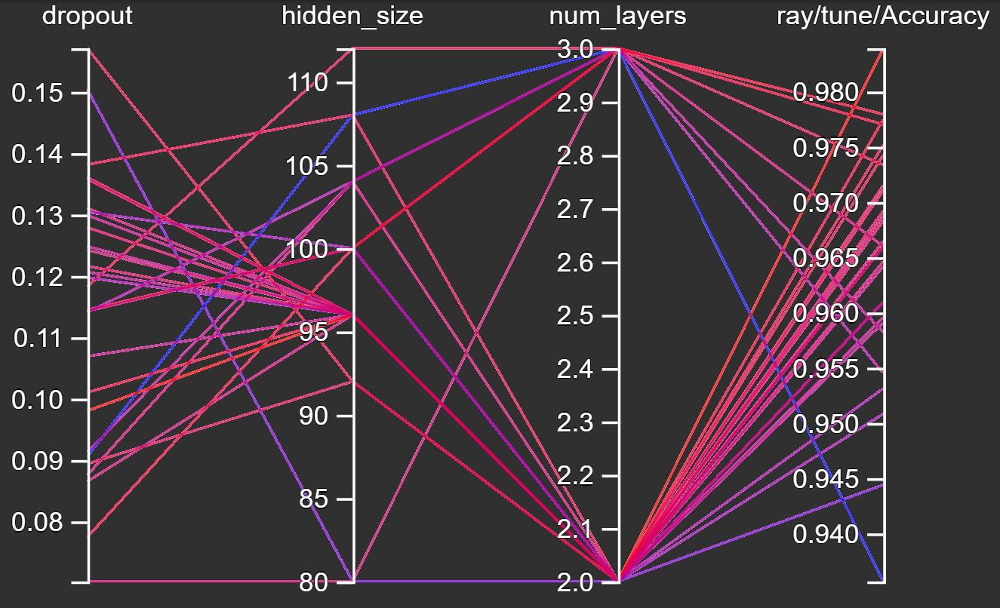
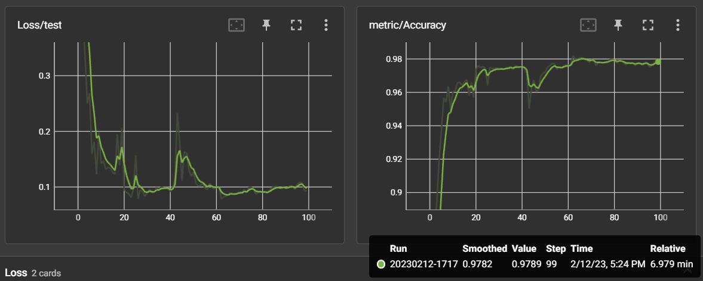

# Tentamen ML2022-2023
*gemaakt door: Pascal van der Kley*

De opdracht is om de audio van 10 cijfers, uitgesproken door zowel mannen als vrouwen, te classificeren. De dataset bevat timeseries met een wisselende lengte.

In [references/documentation.html](references/documentation.html) lees je o.a. dat elke timestep 13 features heeft.
Jouw junior collega heeft een neuraal netwerk gebouwd, maar het lukt hem niet om de accuracy boven de 67% te krijgen. Aangezien jij de cursus Machine Learning bijna succesvol hebt afgerond hoopt hij dat jij een paar betere ideeen hebt.

## Vraag 1

### 1a
In `dev/scripts` vind je de file `01_model_design.py`.
Het model in deze file heeft in de eerste hidden layer 100 units, in de tweede layer 10 units, dit heeft jouw collega ergens op stack overflow gevonden en hij had gelezen dat dit een goed model zou zijn.
De dropout staat op 0.5, hij heeft in een blog gelezen dat dit de beste settings voor dropout zou zijn.

- Wat vind je van de architectuur die hij heeft uitgekozen (een Neuraal netwerk met drie Linear layers)? Wat zijn sterke en zwakke kanten van een model als dit in het algemeen? En voor dit specifieke probleem?

**Antwoord:** 
Veel data is niet linear, zo ook deze data die volgens de methode mel-frequency cepstrum (MFC) is opgeslagen waarbij een aantal niet lineare bewerking worden gedaan. Het kiezen voor uitsluitend lineare layers zal hier dus geen optimale classificatie opleveren. De sterke kanten van dit model is dat het eenvoudiger is waardoor het trainen sneller gaat. Verder kunnen de ruimtes (hyperplanes) niet gekromd worden naar de data waardoor de kans op overfitting in deze toepassing klein is. Je kunt dit lineare model goed gebruiken als baseline model zodat je goed kunt zien welke verbetering je daadwerkelijk haalt met een niet-linear model. 

- Wat vind je van de keuzes die hij heeft gemaakt in de LinearConfig voor het aantal units ten opzichte van de data? En van de dropout?

**Antwoord:**  
Na de tweede lineare laag houdt hij maar 10 units over dat is de helft van het aantal de te classificeren output parameters. Hiermee wordt er dus ge-squeezed en daarna weer ge-expand waardoor er parameters opnieuw moet worden gereconstrueerd, hiermee word het model generalistischer. Het model kan hierdoor minder goed classificeren. Dit is de belangrijkste reden dat het model met deze configuratie maar tot 67% accuracy komt. Met de dropout na de tweede lineare laag van 50% maakt hij de overgebleven units nog generalistischer. Het aantal van 100 output units van de eerste laag (h1) lijkt me een redelijk aantal om vanuit 13 features 20 classes te voorspellen. Wanneer met dit lineare model het aantal units niet overdreven hoog word gekozen lijkt mij een dropout laag niet nodig omdat de kans op overfitting nihil is. 

## 1b
Als je in de forward methode van het Linear model kijkt (in `tentamen/model.py`) dan kun je zien dat het eerste dat hij doet `x.mean(dim=1)` is. 

- Wat is het effect hiervan? Welk probleem probeert hij hier op te lossen? (maw, wat gaat er fout als hij dit niet doet?)

**Antwoord:** 
Er worden 3 dimensies aangeboden (batch x timestaps x features) terwijl de eerste lineare laag twee dimensies nodig heeft (batchsize 128 x 13 input features). Door het gemiddele te nemen van dim 1 (timestaps) wordt deze ge-squeezed en dus verwijderd. 

- Hoe had hij dit ook kunnen oplossen?

**Antwoord:** 
Hij zou ook een 1 dimensionale convolution laag kunnen toevoegen om het aantal dimensies naar 2 te brengen (nn.Conv1d)

- Wat zijn voor een nadelen van de verschillende manieren om deze stap te doen?

**Antwoord:** 
De door hem gekozen methode is eenvoudiger. Bij Conv1d moet je kiezen met welke kernal-size en stride meegeven.

### 1c
Omdat jij de cursus Machine Learning hebt gevolgd kun jij hem uitstekend uitleggen wat een betere architectuur zou zijn.

- Beschrijf de architecturen die je kunt overwegen voor een probleem als dit. Het is voldoende als je beschrijft welke layers in welke combinaties je zou kunnen gebruiken.

**Antwoord:** 
Dit probleem vraag typisch om een RNN oplossing aangezien het timeseries bevat. Het is een kleine dataset en in dat geval zal ik als eerste een GRU (Gated Recurrent Unit) overwegen. Een LSTM zou ook kunnen, maar GRU is nieuwer en efficienter en is meer geschikt voor kleinere datasets. GRU gebruikt minder parameters en is daardoor ook sneller te trainen. Ik zou dus een GRU layer gebruiken gevolgd door een attantion layer en afsluiten met een Linear layer of een Softmax layer om te komen tot de uiteindelijke classificatie voorspelling. Door een attention laag toe te voegen worden bepaalde delen in de timeseries met een andere weging meegenomen (aandacht) en daardoor kan er wellicht een hogere accuracy word gehaald.

- Geef vervolgens een indicatie en motivatie voor het aantal units/filters/kernelsize etc voor elke laag die je gebruikt, en hoe je omgaat met overgangen (bv van 3 naar 2 dimensies). Een indicatie is bijvoorbeeld een educated guess voor een aantal units, plus een boven en ondergrens voor het aantal units. Met een motivatie laat je zien dat jouw keuze niet een random selectie is, maar dat je 1) andere problemen hebt gezien en dit probleem daartegen kunt afzetten en 2) een besef hebt van de consquenties van het kiezen van een range.

**Antwoord:** 
hidden size: Het aantal units per GRU layer: deze zou ik kiezen tussen de 16 en 64, een hoger waarde lijkt mij niet passen bij geringe grote en complexiteit van deze dataset. In eerdere datasets zoals gestures die qua omvang en complexiteit vergelijkbaar was deze range ook afdoende om te onderzoeken. 
layers: het aantal GRU layers dat gebruikt word: Hier zou ik kiezen voor 2 of 3 lagen, ook gezien de geringe complexiteit en omvang. Bij meer lagen wordt het model erg complex met erg veel parameters. Dit past niet bij de compelxiteit van de dataset en zorgt voor onnodige capaciteit bij het trainen en kan zorgen voor overfitting (memoreseren van de data in het model).
dropout: hiervoor verwacht ik dat een waarde tussen 0 en de 30% goed is om te onderzoeken. Een wat hogere waarde voorkomt wellicht dat bij wat langer doortrainen er geen overfitting plaats vindt.
overgang van 3 naar 2 dimensies: 

- Geef aan wat jij verwacht dat de meest veelbelovende architectuur is, en waarom (opnieuw, laat zien dat je niet random getallen noemt, of keuzes maakt, maar dat jij je keuze baseert op ervaring die je hebt opgedaan met andere problemen).

**Antwoord:** 
Meest veelbelovend: GRU model met een attention laag met een hidden size van 64 en 2 of 3 layers en een dropout van 0.3. Grotere hidden size of meer layers verwacht ik sneller overfitting bij het doortrainen. In de antwoorden hierboven 

### 1d
Implementeer jouw veelbelovende model: 

- Maak in `model.py` een nieuw nn.Module met jouw architectuur
- Maak in `settings.py` een nieuwe config voor jouw model
- Train het model met enkele educated guesses van parameters. 
- Rapporteer je bevindingen. Ga hier niet te uitgebreid hypertunen (dat is vraag 2), maar rapporteer (met een afbeelding in `antwoorden/img` die je linkt naar jouw .md antwoord) voor bijvoorbeeld drie verschillende parametersets hoe de train/test loss curve verloopt.
- reflecteer op deze eerste verkenning van je model. Wat valt op, wat vind je interessant, wat had je niet verwacht, welk inzicht neem je mee naar de hypertuning.

**Antwoord:** 
Om er achter te komen welke paramaters welke invloed hebben, heb ik gekozen om onderstaande 4 combinaties te trainen op mijn veelbelovende GRU-Attention model:

- hidden_size=16, num_layers=1, dorpout=0.1
- hidden_size=16, num_layers=3, dorpout=0.1
- hidden_size=64, num_layers=3, dorpout=0.1
- hidden_size=64, num_layers=3, dorpout=0.5

In de Tensorboard weergave van deze resultaten (zie Fig 1. en Fig. 2 hieronder) merk ik op dat de hidden_size van de GRU laag meer invloed geeft op een beter resultaat dan het aantal layers. Het is aan te bevelen om in de hypertuning de hidden_size met nog wat grotere waarden te verkennen. 

In de eerste twee train sessies valt op te merken dat het aantal GRU layers (num_layers) een kleine verbetering geeft op de Accuracy van de voorspelling.

In de laatste twee train sessies heb ik de dropout 0.1 en 0.5 verkend. Het valt hier op dat deze nauwelijks resultaat verschillen opleveren. Het valt aan te bevelen om in de hypertuning de dropout waarde tussen de 0 en 0.1 ook te verkennen.

Verder valt op dat binnen deze 50 training epochs er (nog) geen overfitting plaatsvind. De tweede trainingssessie zie je dat de learning_rate constant blijft. Deze configuratie zouden we nog wat langer kunnen doortrainen om te verkennen of met een afnemende learning_rate het resultaat nog verder kan verbeteren.

<figure>
  

    
    <figcaption align="center">
      <b> Fig 1. Accuracy 4 parameter-combinations in GRU-Attention model</b>
    </figcaption>
  

</figure>

<figure>
  

    
    <figcaption align="center">
      <b> Fig 2. Train/Test Loss 4 parameter combinations in GRU Attention model</b>
    </figcaption>
  

</figure>

## Vraag 2
Een andere collega heeft alvast een hypertuning opgezet in `dev/scripts/02_tune.py`.

### 2a
Implementeer de hypertuning voor jouw architectuur:
- zorg dat je model geschikt is voor hypertuning
- je mag je model nog wat aanpassen, als vraag 1d daar aanleiding toe geeft. Als je in 1d een ander model gebruikt dan hier, geef je model dan een andere naam zodat ik ze naast elkaar kan zien.
- Stel dat je ook iets in de dataloader wil aanpassen maak dan duidelijk wat je hebt gedaan in de code
- voeg jouw model in op de juiste plek in de `tune.py` file.
- maak een zoekruimte aan met behulp van pydantic (naar het voorbeeld van LinearSearchSpace), maar pas het aan voor jouw model.
- Licht je keuzes toe: wat hypertune je, en wat niet? Waarom? En in welke ranges zoek je, en waarom? Zie ook de [docs van ray over search space](https://docs.ray.io/en/latest/tune/api_docs/search_space.html#tune-sample-docs) en voor [rondom search algoritmes](https://docs.ray.io/en/latest/tune/api_docs/suggestion.html#bohb-tune-search-bohb-tunebohb) voor meer opties en voorbeelden.

### 2b
- Analyseer de resultaten van jouw hypertuning; visualiseer de parameters van jouw hypertuning en sla het resultaat van die visualisatie op in `reports/img`. Suggesties: `parallel_coordinates` kan handig zijn, maar een goed gekozen histogram of scatterplot met goede kleuren is in sommige situaties duidelijker! Denk aan x en y labels, een titel en units voor de assen.
- reflecteer op de hypertuning. Wat werkt wel, wat werkt niet, wat vind je verrassend, wat zijn trade-offs die je ziet in de hypertuning, wat zijn afwegingen bij het kiezen van een uiteindelijke hyperparametersetting.

**Antwoord:**

Op basis van de bevindingen tijdens het handmating trainen bij vraag 1d zagen we dat de hidden_size van 64 beter presteerde dan 16. In de eerste hypertune sessie heb ik daarom gekozen om te zoeken tussen 32 en 128 (hidden_size).

Verder zagen we in de handmatigen training dat een dropout van 0.1 of 0.5 weinig verschil maakte. Dit terwijl een dropout van 0.5 al exeptioneel hoog is. Daarom heb ik gekozen om met de hypertuning te gaan zoeken tussen de 0 en 0.2.

Het zoeken van het aantal layers heb ik gekozen tussen 2 en 3 omdat er in de handmating training een kleine verbetering te zien was bij 2 layers in plaast van 1. Een hoger waarde dan 3 levert een voor nu traag en er complex model op waardoor ik heb gekozen om niet hoger te gaan zoeken dan 3 layers.

Uit onderstaande parallel plot (Fig. 3) zien we dat de pogingen met een hoge Accuracy allemaal een hidden_size van tussen de 80 en 110 hebben. Verder bevindt zich de dropout hierbij tussen 0.07 en de 0.18. 

Met deze informatie heb ik een tweede hypertuning gedaan om gedetailleerder te zoeken binnen deze goed scorende parameters. (Fig. 4). Hier

<figure>
  

    
    <figcaption align="center">
      <b> Fig 3. Hypertune eerste sesie</b>
    </figcaption>
  

</figure>

<figure>
  

    
    <figcaption align="center">
      <b> Fig 4. Hypertune tweede sesie</b>
    </figcaption>
  

</figure>

Importeer de afbeeldingen in jouw antwoorden, reflecteer op je experiment, en geef een interpretatie en toelichting op wat je ziet.

### 2c
- Zorg dat jouw prijswinnende settings in een config komen te staan in `settings.py`, en train daarmee een model met een optimaal aantal epochs, daarvoor kun je `01_model_design.py` kopieren en hernoemen naar `2c_model_design.py`.

prijswinnende model: 
- Accuracy: 97,9 %
- Layers: GRU + Attention
- Epochs: 100
- Hidden size: 96
- Layers: 2
- Dropout: 0.098019

<figure>
  

    
    <figcaption align="center">
      <b> Fig 4. Loss/test en Accuracy van het prijswinnende model</b>
    </figcaption>
  

</figure>

## Vraag 3
### 3a
- fork deze repository.
- Zorg voor nette code. Als je nu `make format && make lint` runt, zie je dat alles ok is. Hoewel het in sommige gevallen prima is om een ignore toe te voegen, is de bedoeling dat je zorgt dat je code zoveel als mogelijk de richtlijnen volgt van de linters.
- We werken sinds 22 november met git, en ik heb een `git crash coruse.pdf` gedeeld in les 2. Laat zien dat je in git kunt werken, door een git repo aan te maken en jouw code daarheen te pushen. Volg de vuistregel dat je 1) vaak (ruwweg elke dertig minuten aan code) commits doet 2) kleine, logische chunks van code/files samenvoegt in een commit 3) geef duidelijke beschrijvende namen voor je commit messages
- Zorg voor duidelijke illustraties; voeg labels in voor x en y as, zorg voor eenheden op de assen, een titel, en als dat niet gaat (bv omdat het uit tensorboard komt) zorg dan voor een duidelijke caption van de afbeelding waar dat wel wordt uitgelegd.
- Laat zien dat je je vragen kort en bondig kunt beantwoorden. De antwoordstrategie "ik schiet met hagel en hoop dat het goede antwoord ertussen zit" levert minder punten op dan een kort antwoord waar je de essentie weet te vangen. 
- nodig mij uit (github handle: raoulg) voor je repository. 
